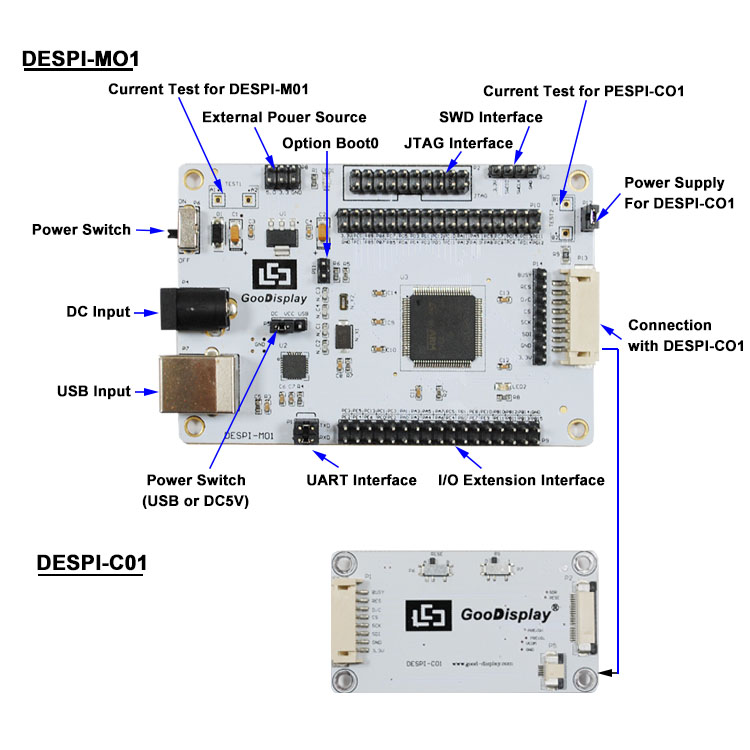

# DESPI-MO1-GCC


Makefile based example to run on gooddisplay's demo board

Since I don't use Keil, I wanted to run the demo board with a Makefile & GCC, so this is their example configured to work with these.

Board URL: <http://www.good-display.com/products_detail/productId=386.html>

By default set to work with GDE0213B1 display.

### Use with:
*   ST-Link
    ```make flash```
*   JLink
    ```make jflash```


